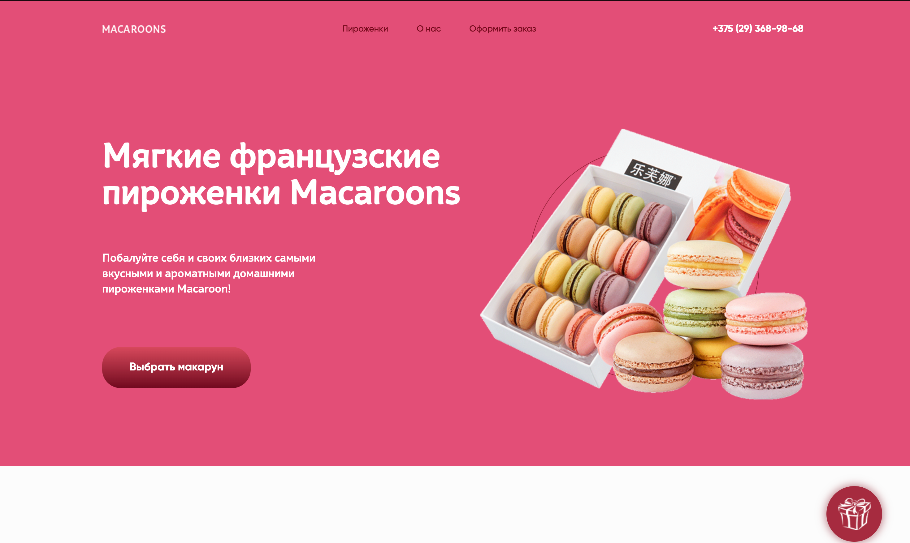

# Проект "Макаруны"

## Описание:
Проект представляет собой лендинг для продажи макарунов. Посетители могут узнать о различных видах макарунов, их ингредиентах и оформить заказ.

  
*Скриншот главной страницы*

## Структура проекта:

```
- assets/
    - images/
    - css/
    - js/
- pages/
    - index.html
    - order.html
    - about.html
- README.md
```

## Используемые технологии:

- **HTML5** - для структурирования контента.
- **CSS3** - для стилизации и адаптивной верстки.
- **JavaScript** - для интерактивных элементов и функциональности заказа.
- **Фреймворк Bootstrap** - для быстрой и адаптивной верстки.
- **jQuery** - для упрощения работы с DOM.

## Рассылка:

Для рассылки новостей и акций используется сервис **Mailchimp**. Пользователи могут подписаться на новостную рассылку, указав свой e-mail.

## Установка и запуск:

1. Клонируйте репозиторий с GitHub:
```
git clone [URL репозитория]
```
2. Откройте файл `index.html` в вашем браузере.

## Лицензия:

Проект распространяется под лицензией MIT.

---

Спасибо за интерес к нашему проекту! Если у вас возникнут вопросы, пожалуйста, обращайтесь по адресу: support@macaroons.com.
